<!-- Copy and paste the converted output. -->

<!-----
NEW: Check the "Suppress top comment" option to remove this info from the output.

Conversion time: 17.029 seconds.

Using this Markdown file:

1. Paste this output into your source file.
2. See the notes and action items below regarding this conversion run.
3. Check the rendered output (headings, lists, code blocks, tables) for proper
   formatting and use a linkchecker before you publish this page.

Conversion notes:

* Docs to Markdown version 1.0β29
* Mon Aug 03 2020 07:28:43 GMT-0700 (PDT)
* Source doc: Milestone 3 README
* Tables are currently converted to HTML tables.
* This document has images: check for >>>>>  gd2md-html alert:  inline image link in generated source and store images to your server. NOTE: Images in exported zip file from Google Docs may not appear in  the same order as they do in your doc. Please check the images!

----->

## Milestone III

Team name: ModuleFuture

Proposed level of achievement: Artemis

## Features preview

- Quick and user-friendly method to create a plan coupled with an intuitive UI to add modules
- Multiple view options to track modules and grades in different categories
- Progress page with an elegant representation of data which tracks the user’s CAP and MC progression

    
    
    

_GIFs are only limited to 10 frames per second (fps) and may have some lag due to the long duration._

## ModuleFuture app

For Android Users:

1. Access the app on Google Play [here](https://play.google.com/store/apps/details?id=com.modulefuture2019.ModuleFuture)!

For iOS Users:

1. Make sure you have [Expo](https://apps.apple.com/us/app/expo-client/id982107779) installed on your phone.
2. Use this account to log into the Expo app on your phone first:

- Username : modulefuture2022
- Password: ModuleFuture2022

3. Enter the app [here](https://expo.io/@modulefuture2022/ModuleFuture)! (You should be able to scan the QR code if necessary).

Error logging in?

If you do not get redirected to the homepage, clear and reopen the app again. If your screen darkens and you are unable to do anything, clear phone RAM and running apps and reopen the app again.

### FAQ

Q) Does your app keep information about my username and password?

A) Yes it is stored in firebase cloud storage.

Q) Does your app use our personal information?

A) We only use the grades that are being entered, any other data is not used without any permission.

Q) What happens if I spot an error or bug that results in the app not being functional?

A) We deeply apologise for any inconveniences caused. That said, please contact any of the developers. It would be great if the problem can be described aptly so that it is reproducible!

### Note

There will be some deviation between IOS and Android phones. Phone sizes of less than 5 inches will likely have inconsistent displays. Performance may vary between phones.

Depending on your phone speed, the waiting time at the loading screen differs, so please be patient!

## Motivation

All of us have experienced the feeling of uncertainty in deciding what modules to take during the start of every university semester, often feeling clueless on what modules to take due to the lack of sufficient planning and preparation. In most cases, students simply follow a recommended study plan or a senior’s / friend’s plan without putting much thought into whether it is suitable for themselves. After a few semesters, when we are ready to choose a specialisation or minor, we find ourselves in yet another huge dilemma, as we are not completely aware of which fields are we better in and what each field is exactly. We find these experiences to be unpleasant for students and seek to find a solution to resolve them.

## Aim

We aim to streamline the way NUS students plan their modules and choose their specialisations through the form of a mobile app.

## User Stories

1. As a student, I want to keep track of the modules (and their grades) that I have taken so that I have a clear understanding of my performance over the semesters and what modules to take in the future.
2. As a student, I want to be able to create multiple academic plans so that I am ready to switch between different academic plans when the need arises.
3. As a student, I want to simulate my CAP based on different academic plans so that I am clear of the path to take to meet my CAP target.
4. As a student, I want to plan modules to take in the future so that I do not end up overloading myself with too heavy of a workload in the future.
5. As a student, I want to know what my categorical CAP is so that I can better understand my strengths and weaknesses and choose the right modules to take.
6. As a student, I want to know the intensity and workload of a module so that I can better plan what modules to take.

## Preliminary Survey

To get a better understanding of the difficulties faced by current NUS Computing students on the matters related to modules and general academic life, we have done a preliminary [survey](https://drive.google.com/file/d/1aeXrTT6FEH8Iqp3SBMeEOW-viN8mYuVy/view?usp=sharing) on a small sample size of 16 SOC students. The general consensus among students seems to be that most are unsure of which focus areas to choose because they do not know which field they are good in and are not well-informed of what each focus area is. Many students also highlighted that them being unaware of the workload and difficulty of each module forms the main difficulty while planning for modules to take in each semester. This further points to a clear lack of transparency in each module, disallowing students from making informed decisions in their module planning.

## Comparison with other similar platforms

<table>
  <tr>
   <td>Name of platform
   </td>
   <td>Problem
   </td>
   <td>Solution
   </td>
  </tr>
  <tr>
   <td>NUSMods
   </td>
   <td>
<ul>

<li>Students only plan one semester ahead, and this could potentially lead to a heavier workload in the later semesters
</li>
</ul>
   </td>
   <td>
<ul>

<li>Provide students with the option to make multiple plans
</li>
</ul>
   </td>
  </tr>
  <tr>
   <td>Cumulative CAP Calculator (NUS)
   </td>
   <td>
<ul>

<li>Not able to forecast grades and CAP by more than one semester
</li>
</ul>
   </td>
   <td>
<ul>

<li>Students are able to plan and forecast their modules for future semesters and preview their CAP accordingly

<li>Option to create and use the CAP of multiple module plans
</li>
</ul>
   </td>
  </tr>
</table>

## Software Engineering Approach

For this project, we decided to use an agile approach for our software development, SCRUM methodology. We decided to keep our project progress via a series of sprints as we believe that our features can be divided into smaller, independent components that could be implemented within 1 - 2 weeks. Both of us decided the number of features that we can commit to and allocated tasks to be completed during each sprint. To meet our target, we tried to complete each feature within one week. We met up daily at night to update each other on what we have done for the day. At the end of each week, we conducted unit testing of our completed features and identified any possible bugs in the program. This feedback loop is essential for us given the fact that we do not have much experience in software development.

## Version Control System

For this project, we picked up Git integration and Github, and split our features into different branches. At the end of each week, we merged into the master branch after checking its functionality. You can view our github graph [here](https://docs.google.com/document/d/14478-enKSBYA9VNpdzKDbmkPWpXFyGDKvdzRuUVU3Zk/edit?usp=sharing).

## Milestone II implementations

- Records tab which shows the overview of modules taken
  - Ease of switching between the 3 categories, type, code, level
  - CAP for each category
  - Colour distinction between the taken and not taken modules so that users can have a better understanding of what to take in the future
  - Allow deletion and addition of modules in records, so that students can plan ahead on the modules to take in the future (without choosing the actual semester)
- Planner
  - Customizable number of semesters to be planned shown in an intuitive scrollable interface
  - Allows users to make many different plans for each semester to simulate different situations (having a backup plan in case of failed module bidding)
  - Color coded to notify user for any conflict when adding module
  - Users are able to set their target grade and compare with their final grade when the semester ends
- Add modules
  - Module database showing all modules
  - Prereq info integrated for each module which allows users to seamlessly view the prerequisites for each module
  - Manual searches are conveniently located on top of the modules for ease of searching
  - A wide range of filter options to allow users to easily search modules among the large module database. These options include:
    - Filter by module level, code, number of MCs, S/U option, and no exam
- Focus Area
  - Suggestion of focus areas based on the top 3 performing focus areas in terms of CAP (Calculation is based on the grades of the prerequisites of the primary modules in the focus area)
  - Tracks the number of prerequisites taken for the primary modules in the focus areas
  - Toggle between the focus area prerequisites, primaries and elective modules to see the number of modules taken and CAP for each category
- Progress Page
  - Graphical representation of user’s CAP progression over all semesters
  - Users can click on the data points to see the performance for each individual semester
  - Tracking of user’s MC progress and CAP goal with radial progress bar
- Profile page
  - List of graduation semester, changing of course, and focus area
- Login page
  - Collection of details: Year of matriculation, Expected graduation semester, Course

## Milestone III Features

- Planner
  - Added a What If Feature such that allows users to plan ahead in time and be able to forecast their CAP using multiple plans from a semester
  - Added a favourite plans button which allows users to access the plan directly from the home page
  - Having a quick navigation at the end of the planner, providing quick access to the progress page and home page. Quick navigation also includes smart suggestions for users to plan for recent and / or future semesters
  - Deletion of plans notification
  - Provided a 2-step deletion of modules, preventing users from misclicking and deleting the module by accident
- Progress Page
  - Improved UI of modal popup from clicking data points in the graph - It now compares the overall and semestral CAP from the previous semester, and shows the number of MCs taken VS number of MCs used in CAP computation
- Records
  - Preloading of modules for courses in SOC
  - Full view tab which provides users with an overall view of the modules taken and those yet to be taken
  - Added editing of types
    - Addition / deletion of newly added types (We disallowed the deletion of preloaded types since those are essential for graduation)
    - Allowed non-SOC students to use the app too
    - Editing of MCs required and number required for each type
    - MCs indication to show the number of missing MCs from the target MCs
- Focus Area
  - Allowed editing of focus areas, similar to that of records
  - Allowed addition and deletion of modules in prerequisites, accounting for students who are taking a different variation of a module
- Search modules
  - Created workload displays
  - Beautified design for module searching and added a short summary of the description for each module
  - Semester tabs which allow users to view which semesters the module is offered in
  - Real-time updating of number of modules based on the filter selection
  - Preclusions and prerequisites data (if applicable)
  - Provided link to NUSMods for students to view other information like timetable, which we purposefully did not include since our app is primarily meant for users to plan a few semesters in advance
- Add modules
  - Added information and requirement popups
- Profile page
  - Email verification
  - Mini tutorial shown for new users to the app(if email not verified)
  - Full-fledged Tutorial in the profile page
  - About page
    - About
    - FAQ
    - Note
    - Developers
    - Photo Credits
    - Terms and Conditions
- Login page
  - Added a password check using regex and a password meter for users to see their password strength. This is implemented based on the following metrics:
    - Min 8 characters
    - At least 1 symbol
    - At least 1 capital letter
    - At least 1 small letter
    - At least 1 number
  - Forget password
  - Widen our app from previously catering to 5 SOC courses to now all NUS courses
  - Including Terms and Conditions to be read and accepted before creating an account

## Features Demo

<table>
  <tr>
   <td>Features
   </td>
   <td>Description
   </td>
   <td>Link
   </td>
  </tr>
  <tr>
   <td>Login
   </td>
   <td>
<ul>

<li>Short video to demo the login process
</li>
</ul>
   </td>
   <td><a href="https://www.youtube.com/watch?v=cZaf6DJxYm0">https://www.youtube.com/watch?v=cZaf6DJxYm0</a>
   </td>
  </tr>
  <tr>
   <td>Planner
   </td>
   <td>
<ul>

<li>Short demonstrate on how to use the features of the planner
</li>
</ul>
   </td>
   <td>Basic Planner

<a href="https://www.youtube.com/watch?v=NBDt2d2tzX4">https://www.youtube.com/watch?v=NBDt2d2tzX4</a>

What If Feature

<a href="https://www.youtube.com/watch?v=WK0AeTZiRWg">https://www.youtube.com/watch?v=WK0AeTZiRWg</a>
   </td>
  </tr>
  <tr>
   <td>Progress page
   </td>
   <td>
<ul>

<li>UI design of the progress page
</li>
</ul>
   </td>
   <td><a href="https://www.youtube.com/watch?v=xin5y4nkEWA">https://www.youtube.com/watch?v=xin5y4nkEWA</a>
   </td>
  </tr>
  <tr>
   <td>Records
   </td>
   <td>
<ul>

<li>Short demo on the records page usage and how to use it if incase of deviation from preloaded data
</li>
</ul>
   </td>
   <td><a href="https://www.youtube.com/watch?v=FrgP23uyG6w">https://www.youtube.com/watch?v=FrgP23uyG6w</a>
   </td>
  </tr>
  <tr>
   <td>Focus Area
   </td>
   <td>
<ul>

<li>Short demo on how to use the features in the focus area page.
</li>
</ul>
   </td>
   <td><a href="https://www.youtube.com/watch?v=9-6VfonRujQ">https://www.youtube.com/watch?v=9-6VfonRujQ</a>
   </td>
  </tr>
  <tr>
   <td>Module search
   </td>
   <td>
<ul>

<li>Short demo on the module search usage
</li>
</ul>
   </td>
   <td><a href="https://www.youtube.com/watch?v=2VAU1dgu7b0">https://www.youtube.com/watch?v=2VAU1dgu7b0</a>
   </td>
  </tr>
  <tr>
   <td>Profile
   </td>
   <td>
<ul>

<li>Short demo on the email verification, changing of personal details and tutorial highlights
</li>
</ul>
   </td>
   <td>Part I

<a href="https://www.youtube.com/watch?v=DaEoMvnnWEk">https://www.youtube.com/watch?v=DaEoMvnnWEk</a>

Part II

<a href="https://www.youtube.com/watch?v=2xF4rNq_hjA">https://www.youtube.com/watch?v=2xF4rNq_hjA</a>
   </td>
  </tr>
</table>

## User Interface/Experience

For our app, we spent a lot of time designing and doing up the UI/UX components as we believe that it plays a major role in a good planning experience for students.

<table>
  <tr>
   <td>

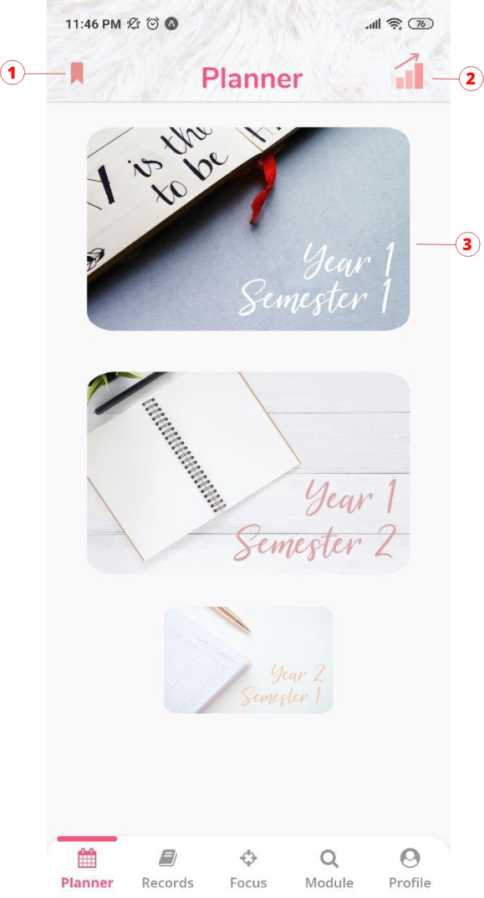

   </td>
   <td>On login/signup, users are presented with a scrollable list of plans for each semester. The images are loaded lazily as the users scroll for optimization purposes. With our intuitive bottom navigation bar, users can move between screens with ease to view the features in our app.
<ol>

<li>Favourite plan: Provides quick access to a chosen plan.

<li>Progress bar: Clicking this will bring users to the progress page to view their results and cap progression.

<li>Semester template: Clicking this will bring users into each semester to begin their module planning.
</li>
</ol>
   </td>
  </tr>
  <tr>
   <td>

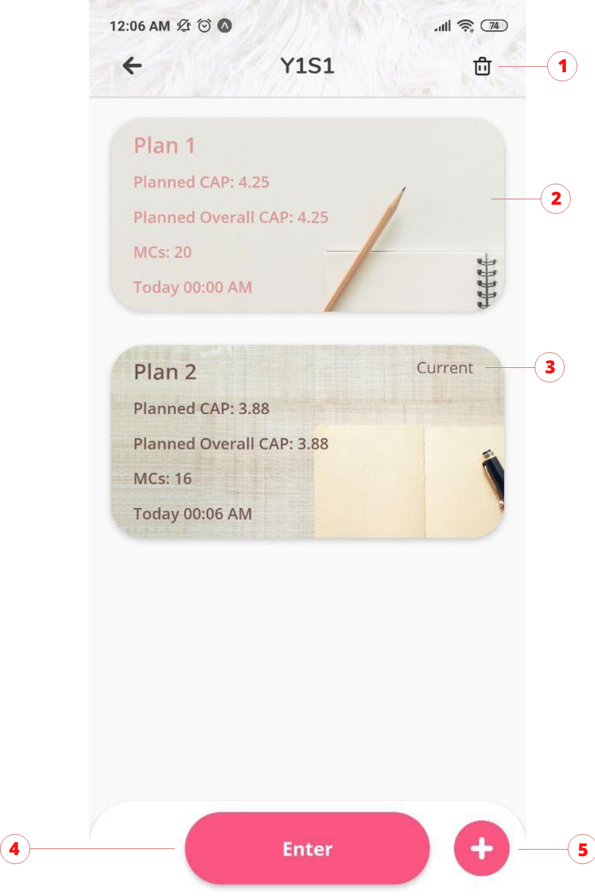

   </td>
   <td>
<ol>

<li>The dustbin icon deletes whichever current plan is selected at the current point in time. There will be a confirmation message to inform users that the plan has been deleted.

<li>Relevant information of the plan will be displayed  
<ul>
 
<li>CAP & MC of this plan
 
<li>Overall CAP - incorporating the what-if feel whereby users can change their current selected plan to update future overall CAP
 
<li>Current timestamp - allows users to backtrack to whichever to their latest plan
</li> 
</ul>

<li>The word current indicates to the user which plan is being selected and used.

<li>Pressing enter will bring the user into the plan. If there is no current being selected, there will be an alert message.

<li>Clicking the plus button will allow the user to create a new plan.
</li>
</ol>
   </td>
  </tr>
  <tr>
   <td>

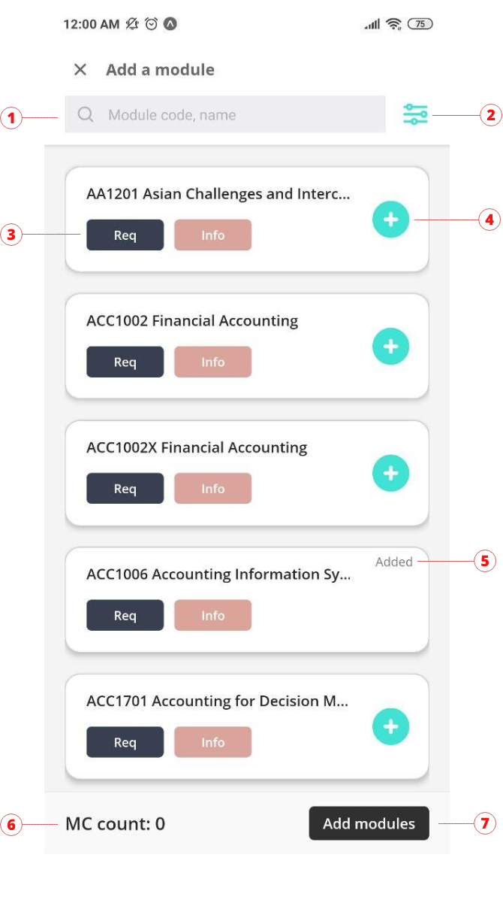

   </td>
   <td>
<ol>

<li>Search function for users to find their module.

<li>In-depth filter function to narrow down module list

<li>Req and Info button where users can see the relevant information and prerequisites and preclusions of that module.

<li>Module adding button, which when clicked will slide the module off to the left indicating successful addition.

<li>Added word at the top right hand corner which appears when the module is originally in the plan to prevent users from re-adding the same module.

<li>MC count which updates in real time, in terms of total number of MCs of all the modules added.

<li>Clicking the add module button will bring you to the next screen where you confirm the addition of these modules.
</li>
</ol>
   </td>
  </tr>
  <tr>
   <td>

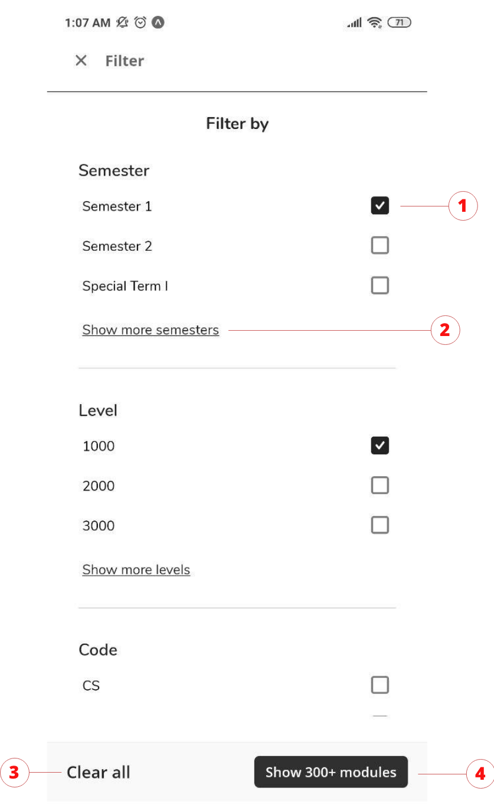

   </td>
   <td>
<ol>

<li>Toggling of filter options

<li>Load time optimisation is done here by presenting 3 filter choices initially, and allowing users to click show more to view more options if need to. A hide more option appears when the user clicks show more. This reduces the number of options back to the original 3.

<li>Clear All provides a quick and intuitive way for students to clear all filter options.

<li>Real-time updating of number of modules based on the current filters applied.
</li>
</ol>
   </td>
  </tr>
  <tr>
   <td>

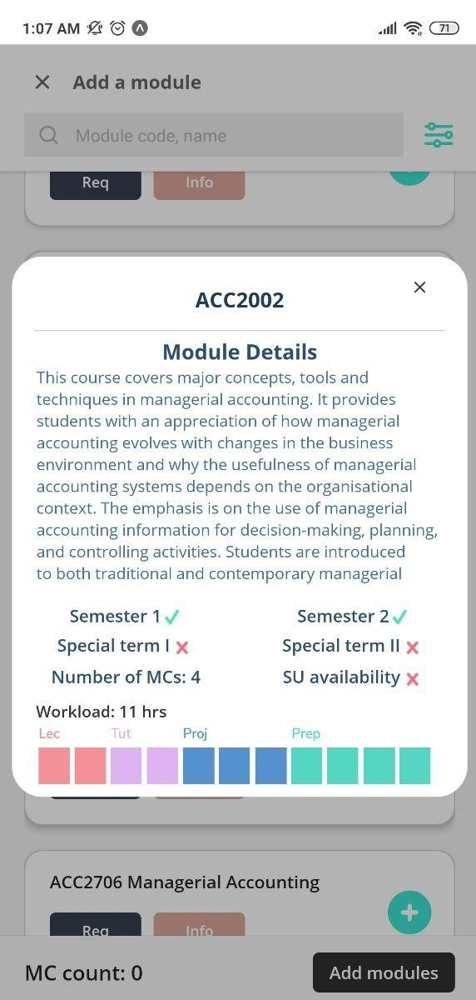

   </td>
   <td>Clicking the info button will display the module information. 

Some of the information include 
<ul>

<li>Module details

<li>Semester offered

<li>Number of MCs

<li>SU availability

<li>Workload

Similarly, if users wish to see information on the prerequisites and preclusions, they can click on the Req button to do so.
</li>
</ul>
   </td>
  </tr>
  <tr>
   <td>

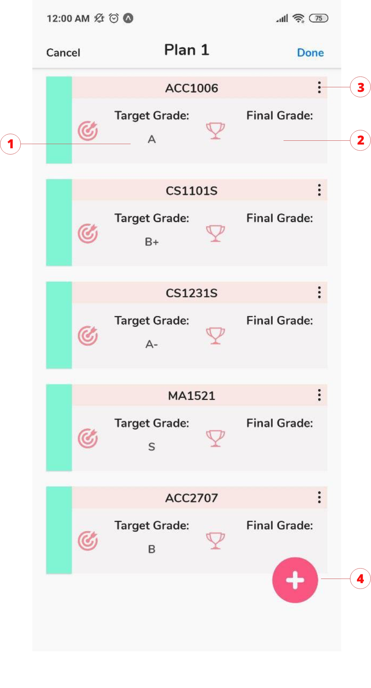

   </td>
   <td>
<ol>

<li>Students can click the target grade to select and change their target grades.

<li>Similarly, users can click to insert their final grade at the end of each semester.

<li>Pressing the ellipsis will allow users to delete the modules in a 2-step action. This prevents users from misclicking and deleting the module by accident.

<li>Pressing this button allows users to add more modules from the Add Module page. This floating plus icon is designed such that it is hidden whenever scrolling is done to prevent instances where users are unable to click on the final grade of a module.
</li>
</ol>
   </td>
  </tr>
  <tr>
   <td>

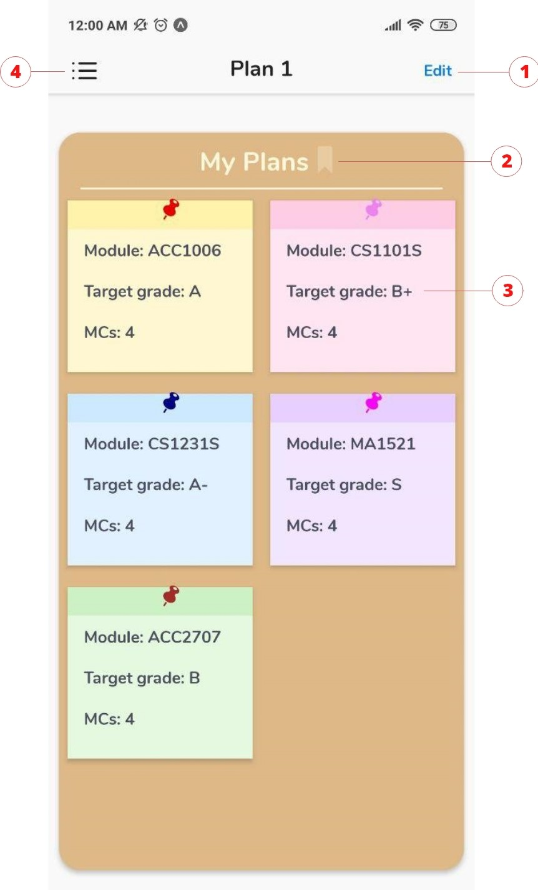

   </td>
   <td>
<ol>

<li>Pressing the button will lead the user to the page where users can edit the current modules in this plan.

<li>Pressing this button will favourite this current plan. Currently we are only allowing users to have 1 favourite plan for this entire app.

<li>A post-it display of the modules and its very brief information.

<li>Drawer navigation which allows quick navigation to other tabs.
</li>
</ol>
   </td>
  </tr>
  <tr>
   <td>

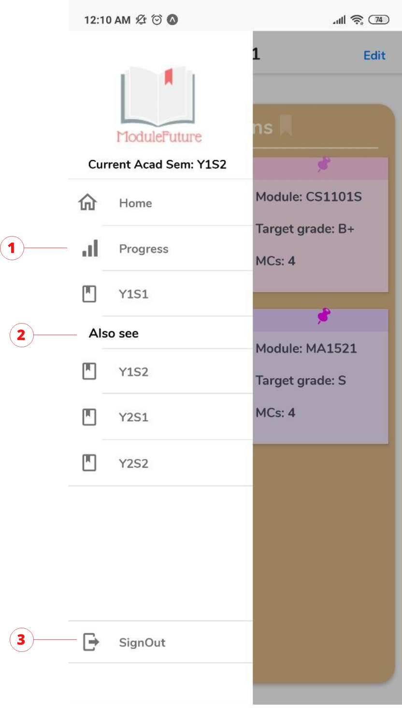

   </td>
   <td>
<ol>

<li>The drawer allows users to have quick access to various tabs in the planner like progress page and home.

<li>Suggest users to see recent or future semesters to being their module planning.

<li>Provide a quick alternative for users to log out after they are done with their module plan.
</li>
</ol>
   </td>
  </tr>
  <tr>
   <td>

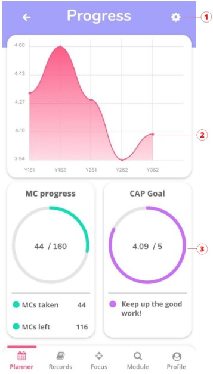

   </td>
   <td>
<ol>

<li>Settings: Allow users to change their total MCs required for graduation and CAP target.

<li>CAP graph which provides an intuitive and beautiful UI for users to analyse their CAP progression. Clicking each individual data point will display a popup which displays CAP info and comparison with the previous semester.

<li>Radial progress bars displaying the MC progress and the CAP goal. Customised text messages based on the student’s CAP-to-target ratio is also shown to the student for encouragement.
</li>
</ol>
   </td>
  </tr>
  <tr>
   <td>

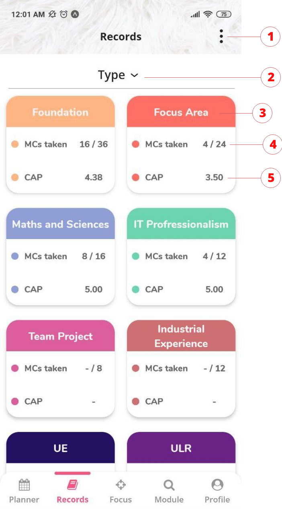

   </td>
   <td>
<ol>

<li>Clicking this button will allow users to choose between toggling between MCs taken and number of modules taken, and other options like Full View and Edit current types

<li>Allow toggling between Type, Code, Level

<li>Each of the tabs displays the types preloaded from the NUS website for the user’s specific course. Users can click the floating box to see the modules and their grades in this type.

<li>Displays the fraction of modules cleared and required

<li>Displays the CAP achieved for this type
</li>
</ol>
   </td>
  </tr>
  <tr>
   <td>

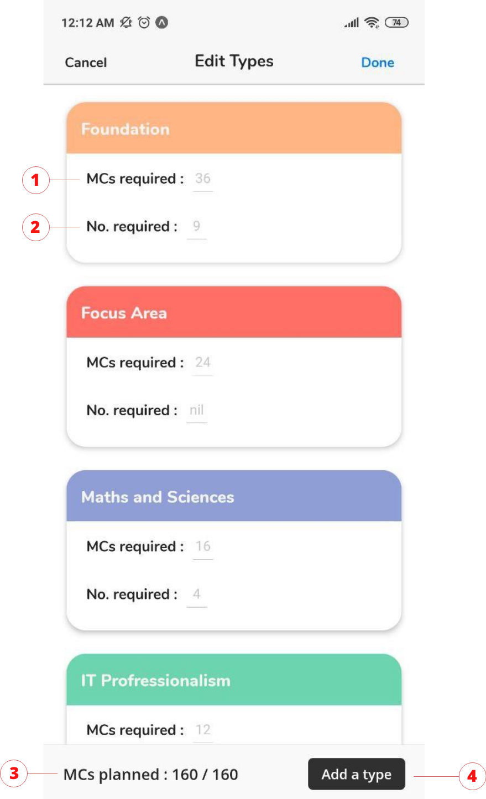

   </td>
   <td>
<ol>

<li>For users to edit the MCs required

<li>For users to edit the number required (to be left blank if there is no fixed number)

<li>Total MCs in the records against the total amount of MCs required for graduation

<li>Allow users to add a new type if it is not found in the current types. Note that only newly added types can be deleted as we want to ensure that students do not delete the preloaded main types on accident
</li>
</ol>
   </td>
  </tr>
  <tr>
   <td>

   </td>
   <td>
<ol>

<li>If the user has taken this module and inputted in the final grade before, this module will have a darken color tone representing taken

<li>If the module yet to be taken, it is represented with a lighter color tone

<li>Pressing the edit button allows user to add in any modules that are not preloaded; or to delete any modules in this type

<li>This will inform the users how many more MCs they are required to plan in order to fulfill the graduation requirements for the current type
</li>
</ol>
   </td>
  </tr>
  <tr>
   <td>

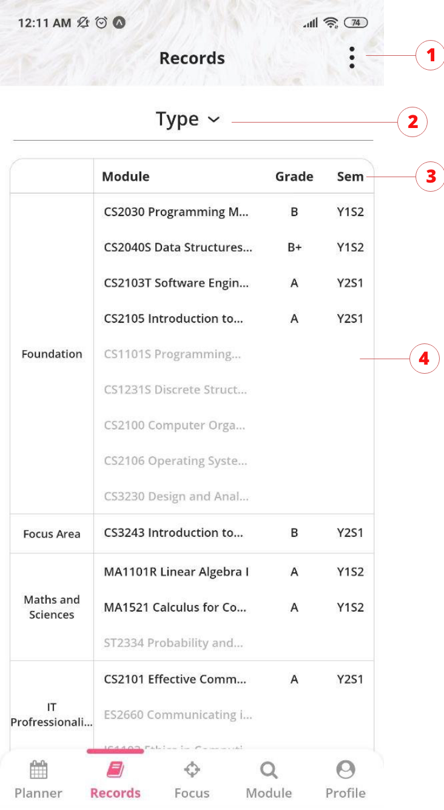

   </td>
   <td>
<ol>

<li>Toggle between showing all modules and  only the taken modules

<li>Toggling between Code and Level and Type

<li>Headers for the users

<li>Displaying all the modules required for graduation for each section
</li>
</ol>
   </td>
  </tr>
  <tr>
   <td>

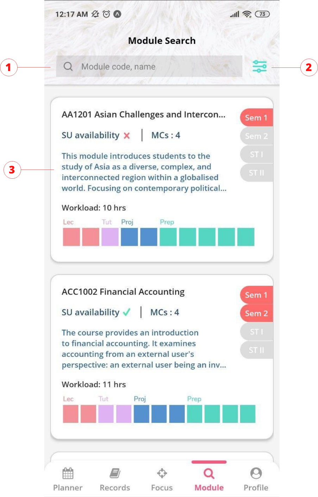

   </td>
   <td>
<ol>

<li>Search functions where users can use to search for their modules - the state of the search is being saved such that if the users accidentally exit this tab or complete other tasks in the app, the users can jump right back into where they left off

<li>Similar to the add modules page, users can use this filter function to find their modules

<li>A beautiful display where users can view a brief information of the modules. If they wish to see the full information, clicking into it will lead them into another page which displays the full module summary, prerequisites and the preclusions of the module.
</li>
</ol>
   </td>
  </tr>
  <tr>
   <td>

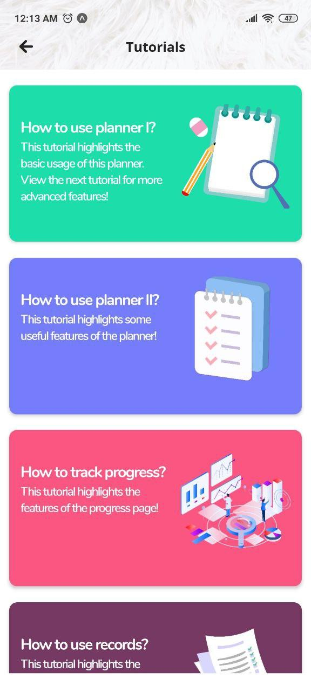

   </td>
   <td>Based on our user surveys and testing, we realised there were some issues with users being stuck at various points. Thus, we discussed and implemented a tutorial so that users will be taught and guided on how to use the app. There are five main parts to our tutorial
<ul>

<li>How to use planner I (basic planner feature)

<li>How to use planner II (What If feature)

<li>How to track progress

<li>How to use records page

<li>How to use focus area
</li>
</ul>
   </td>
  </tr>
</table>

## User Testing

To get a rough gauge of our UI/UX design, we have conducted user [surveys](https://docs.google.com/document/d/1YPkFKglhtRNbcvDl5SNSPAxfHRVbbLFACAoH0MUF7Ik/edit?usp=sharing) on some of our friends in SOC to get some information on our current app and its features. We also gathered some questions along our implementation of the features and asked them too.

### Problems and suggestion from Milestone II user testings

<table>
  <tr>
   <td>S/N
   </td>
   <td>Features / Problems
   </td>
   <td>Solution
   </td>
  </tr>
  <tr>
   <td>1)
   </td>
   <td>App could use a Tutorial (Feature)
   </td>
   <td>
<ul>

<li>(SOLVED) Added a mini-tutorial for first time user login as well as a full-fledged tutorial in the profile page for users to learn the app features.
</li>
</ul>
   </td>
  </tr>
  <tr>
   <td>2)
   </td>
   <td>Problems of finding the progress page (Problem)
   </td>
   <td>
<ul>

<li>(SOLVED) Added a color gradient icon that looks like a bar graph which better represents a progress page.
</li>
</ul>
   </td>
  </tr>
  <tr>
   <td>3)
   </td>
   <td>Unclear icon for drawer navigation

(Problem)
   </td>
   <td>
<ul>

<li>(SOLVED) Added the hamburger icon instead.
</li>
</ul>
   </td>
  </tr>
  <tr>
   <td>4)
   </td>
   <td>Unclear terminologies in the app

(Problem)
   </td>
   <td>
<ul>

<li>(SOLVED) Changed according to the results of the user testing.
</li>
</ul>
   </td>
  </tr>
  <tr>
   <td>5)
   </td>
   <td>Night mode (Feature)
   </td>
   <td>
<ul>

<li>(UNSOLVED) Due to the lack of time, we decided to not implement this feature and to work on other features instead.
</li>
</ul>
   </td>
  </tr>
</table>

### Problems and suggestion from Milestone II peer-review

<table>
  <tr>
   <td>S/N
   </td>
   <td>Features / Problems
   </td>
   <td>Solution
   </td>
  </tr>
  <tr>
   <td>1)
   </td>
   <td>Implement checks on the final grade (Feature)
   </td>
   <td>
<ul>

<li>(SOLVED) Added checks on the text input and alerted users if the input grades are not valid.
</li>
</ul>
   </td>
  </tr>
  <tr>
   <td>2)
   </td>
   <td>Have a 'Forgot Password' feature for users. (Feature)
   </td>
   <td>
<ul>

<li>(SOLVED) Added a forget password feature in the login page for users. A link to reset their password will be sent to their email registered with the app.
</li>
</ul>
   </td>
  </tr>
  <tr>
   <td>3)
   </td>
   <td>Implement a password complexity requirements of min 8 characters, at least 1 symbol, at least 1 capital letter, at least 1 small letter and at least 1 number)

(Feature)
   </td>
   <td>
<ul>

<li>(SOLVED) Added a password check and a responsive password meter for users to see their password strength.
</li>
</ul>
   </td>
  </tr>
  <tr>
   <td>4)
   </td>
   <td>Colour coding modules by type may improve the user experience. (Feature)
   </td>
   <td>
<ul>

<li>(UNSOLVED) Due to the large amount of module codes (260+), we concluded that it was not possible to map each module code to a different colour without any form of colour clashing.
</li>
</ul>
   </td>
  </tr>
  <tr>
   <td>5)
   </td>
   <td>App only allows 5 courses initially (Problem & Feature)
   </td>
   <td>
<ul>

<li>(SOLVED) Implemented a dropdown list to include all possible courses that are in the NUS database system. Also allowed users to add in their own types and focus areas
</li>
</ul>
   </td>
  </tr>
  <tr>
   <td>6)
   </td>
   <td> Email verification (Feature)
   </td>
   <td>
<ul>

<li>(SOLVED) Implemented a “forced” implementation of email verification in the form of needing to do the tutorial repeatedly if email verification is not done.
</li>
</ul>
   </td>
  </tr>
</table>

### Problems or suggestion from Milestone III user testings

<table>
  <tr>
   <td>S/N
   </td>
   <td>Features / Problems
   </td>
   <td>Solution
   </td>
  </tr>
  <tr>
   <td>1)
   </td>
   <td>Tutorial length (Problem)
   </td>
   <td>
<ul>

<li>(SOLVED) Initially the tutorial was too long and lengthy in instructions, we tried our best to paraphrase succinctly and removed some content.
</li>
</ul>
   </td>
  </tr>
  <tr>
   <td>2)
   </td>
   <td>Unclear terminologies in the app

(Problem)
   </td>
   <td>
<ul>

<li>(SOLVED) Implemented a full-fledged tutorial to every main feature, which explained the complex terminologies of the app.
</li>
</ul>
   </td>
  </tr>
  <tr>
   <td>3)
   </td>
   <td>Faced lag while adding modules (Problem)
   </td>
   <td>
<ul>

<li>(Partially SOLVED) We managed to remove most of the latency issues in the app preloading images and abiding to software engineering principles.
</li>
</ul>
   </td>
  </tr>
</table>

## Project Log

<table>
  <tr>
   <td>S/N
   </td>
   <td>Task
   </td>
   <td>Date
   </td>
   <td>Keane Chan
   </td>
   <td>Sean Lum
   </td>
   <td>Duration

(in hours

individually)
   </td>
  </tr>
  <tr>
   <td>1)
   </td>
   <td>Liftoff day 1
   </td>
   <td>11/05/2020
   </td>
   <td colspan="2" >
<ul>

<li>Reading up relevant material and instructions

<li>Furnishing proposal details
</li>
</ul>
   </td>
   <td>4
   </td>
  </tr>
  <tr>
   <td>2)
   </td>
   <td>Team Meeting
<ul>

<li>Formulation of draft and ideas

<li>Draft for poster and video
</li>
</ul>
   </td>
   <td>12/05/2020
   </td>
   <td colspan="2" >
<ul>

<li>Ideations

<li>Evaluation of ideas

<li>Poster design and content

<li>Adviser’s feedback
</li>
</ul>
   </td>
   <td>4
   </td>
  </tr>
  <tr>
   <td>3)
   </td>
   <td>Team Meeting
<ul>

<li>Collection of data and draft of user flow

<li>Poster and video finalising
</li>
</ul>
   </td>
   <td>13/05/2020
   </td>
   <td colspan="2" >
<ul>

<li>Gather user requirements through surveys

<li>Creation user flow diagram

<li>Poster design and content

<li>Adviser’s feedback
</li>
</ul>
   </td>
   <td>4
   </td>
  </tr>
  <tr>
   <td>4)
   </td>
   <td>Team Meeting
<ul>

<li>Collating the data

<li>Mentor matching
</li>
</ul>
   </td>
   <td>14/05/2020
   </td>
   <td colspan="2" >
<ul>

<li>Editing the proposal to suit the missing features from the data that we collected

<li>Picking of mentor
</li>
</ul>
   </td>
   <td>4
   </td>
  </tr>
  <tr>
   <td>5)
   </td>
   <td>Learning of tech-stack and meeting with advisor and mentor

Team Meeting
<ul>

<li>Editing of proposal

<li>Implementation details
</li>
</ul>
   </td>
   <td>15/05/2020 - 24/05/2020
   </td>
   <td colspan="2" >
<ul>

<li>Software engineering design

<li>UI/UX design

<li>GitHub

<li>React Native

<li>JavaScript

<li>Discuss and improve core features and extensions

<li>Editing of user flow diagram
</li>
</ul>
   </td>
   <td>22
   </td>
  </tr>
  <tr>
   <td rowspan="2" >6)
   </td>
   <td rowspan="2" >UI/UX design for lo-fi and hi-fi prototype 

(for core features)

Milestone 1 report
<ul>

<li>README

<li>Video + poster edit
</li>
</ul>
   </td>
   <td rowspan="2" >25/05/2020 -

31/05/2020
   </td>
   <td>
<ul>

<li>Work on homepage and module planner lo-fi and hi-fi prototype
</li>
</ul>
   </td>
   <td>
<ul>

<li>Work on login and signup lo-fi and hi-fi prototype
</li>
</ul>
   </td>
   <td rowspan="2" >30
   </td>
  </tr>
  <tr>
   <td colspan="2" >
<ul>

<li>Work on the README report

<li>Discussion to improve video and poster design
</li>
</ul>
   </td>
  </tr>
  <tr>
   <td rowspan="2" >7)
   </td>
   <td rowspan="2" >Learning of tech-stack 

Implementation
<ul>

<li>Login

<li>Profile

Team meeting
<ul>

<li>Discuss and review the current and next feature to be implemented using pivotal tracker
</li>
</ul>
</li>
</ul>
   </td>
   <td rowspan="2" >01/06/2020-

07/06/2020
   </td>
   <td colspan="2" >
<ul>

<li>Learning firebase and react native

<li>Test each other’s implementation to check for bugs

<li>Highlighted additional UI improvements that can be added
</li>
</ul>
   </td>
   <td rowspan="2" >30
   </td>
  </tr>
  <tr>
   <td>
<ul>

<li>Started on the implementation for the Profile page
</li>
</ul>
   </td>
   <td>
<ul>

<li>Started on the implementation for the Login page
</li>
</ul>
   </td>
  </tr>
  <tr>
   <td rowspan="2" >8)
   </td>
   <td rowspan="2" >Implementation
<ul>

<li>Progress

<li>Records tab

Team meeting
<ul>

<li>Discuss and review the current and next feature to be implemented using pivotal tracker

Documentation
<ul>

<li>Documented some of the features that we have completed
</li>
</ul>
</li>
</ul>
</li>
</ul>
   </td>
   <td rowspan="2" >08/06/2020-

14/06/2020
   </td>
   <td colspan="2" >
<ul>

<li>Test each other’s implementation to check for bugs

<li>Highlighted additional UI improvements that can be added
</li>
</ul>
   </td>
   <td rowspan="2" >30
   </td>
  </tr>
  <tr>
   <td>
<ul>

<li>Started on the implementation for the Records tab
</li>
</ul>
   </td>
   <td>
<ul>

<li>Started on the implementation for the Progress page
</li>
</ul>
   </td>
  </tr>
  <tr>
   <td rowspan="2" >9)
   </td>
   <td rowspan="2" >Implementation
<ul>

<li>Planner

<li>Focus Area

Team meeting
<ul>

<li>User testing to be created and reflect in our changes

<li>Discuss and review the current and next feature to be implemented

 
</li>
</ul>
</li>
</ul>
   </td>
   <td rowspan="2" >15/06/2020-

21/06/2020
   </td>
   <td colspan="2" >
<ul>

<li>Test each other’s implementation to check for bugs

<li>Create and conduct user testing.

<li>Implement relevant changes from the reviews from the user testing
</li>
</ul>
   </td>
   <td rowspan="2" >30
   </td>
  </tr>
  <tr>
   <td>
<ul>

<li>Started on the implementation for the focus area
</li>
</ul>
   </td>
   <td>
<ul>

<li>Started on the implementation for the Planner
</li>
</ul>
   </td>
  </tr>
  <tr>
   <td rowspan="2" >10)
   </td>
   <td rowspan="2" >Implementation
<ul>

<li>Add modules page

<li>Integration of the app

Milestone II report
<ul>

<li>README

<li>Video + edit poster
</li>
</ul>
</li>
</ul>
   </td>
   <td rowspan="2" >22/06/2020-

28/06/2020
   </td>
   <td colspan="2" >
<ul>

<li>Work on the README report

<li>Editing relevant changes in the poster and video
</li>
</ul>
   </td>
   <td rowspan="2" >30
   </td>
  </tr>
  <tr>
   <td>
<ul>

<li>Started on the implementation for the Add modules page
</li>
</ul>
   </td>
   <td>
<ul>

<li>Started on the integration for the different features into the planner
</li>
</ul>
   </td>
  </tr>
  <tr>
   <td rowspan="2" >11)
   </td>
   <td rowspan="2" >Implementation
<ul>

<li>CAP forecast integration into planner

<li>Module searching function

<li>Reviewing and implementing features that are suggested in Milestone II feedback
</li>
</ul>
   </td>
   <td rowspan="2" >29/06/2020-05/07/2020
   </td>
   <td colspan="2" >
<ul>

<li>Test each other’s implementation to check for bugs

<li>Create user testing questions and tasks
</li>
</ul>
   </td>
   <td rowspan="2" >25
   </td>
  </tr>
  <tr>
   <td>
<ul>

<li>Started on the Module search function

<li>Tested for other courses
</li>
</ul>
   </td>
   <td>
<ul>

<li>Started on the implementation for the CAP forecast integration
</li>
</ul>
   </td>
  </tr>
  <tr>
   <td rowspan="2" >12)
   </td>
   <td rowspan="2" >Team meeting
<ul>

<li>Conduct user test

<li>Meeting with mentor to update on our progress and get relevant advice and review

Implementation
<ul>

<li>Fixing any bugs or UI / UX issues from our user testing

<li>Addition of small features as reflected from users reply

<li>Addition of new key features (security)
</li>
</ul>
</li>
</ul>
   </td>
   <td rowspan="2" >06/07/2020-12/07/2020
   </td>
   <td colspan="2" >
<ul>

<li>Survey a small group of friends, allowing them to use our app to find any plausible bugs.

<li>Giving our users a set of tasks to perform to see if UX experience is optimal

<li>Fixing any relevant bugs
</li>
</ul>
   </td>
   <td rowspan="2" >25
   </td>
  </tr>
  <tr>
   <td>
<ul>

<li>Did email verification, reset password as well as a animated password meter
</li>
</ul>
   </td>
   <td>
<ul>

<li>Did a tutorial interactive screen for first time user as well as a tutorial guide
</li>
</ul>
   </td>
  </tr>
  <tr>
   <td>13)
   </td>
   <td>Team meeting
<ul>

<li>Conduct user test

Implementation
<ul>

<li>Fixing any bugs or UI / UX issues arose from the user test
</li>
</ul>
</li>
</ul>
   </td>
   <td>13/07/2020-19/07/2020
   </td>
   <td colspan="2" >
<ul>

<li>Survey a small group of friends, allowing them to use our app to find any plausible bugs.

<li>Giving our users a set of task to perform to see if UX experience is of standard

<li>Improve the UI for search module, planner and records pages

<li>Fixing any relevant bugs 
</li>
</ul>
   </td>
   <td>25
   </td>
  </tr>
  <tr>
   <td rowspan="2" >14)
   </td>
   <td rowspan="2" >Implementation
<ul>

<li>Fixing any bugs

<li>Cleaning of code

Milestone III report
<ul>

<li>README

<li>Video + edit poster
</li>
</ul>
</li>
</ul>
   </td>
   <td rowspan="2" >20/07/2020-27/07/2020
   </td>
   <td rowspan="2" colspan="2" >
<ul>

<li>Work on the README report.

<li>Editing relevant changes in the poster and video.

<li>Survey a small group of friends, allowing them to use our app to find any plausible bugs.

<li>Fixing any relevant bugs

<li>Cleaning of code for maintainability
</li>
</ul>
   </td>
   <td rowspan="2" >25
   </td>
  </tr>
  <tr>
  </tr>
  <tr>
   <td>
   </td>
   <td>TOTAL HOURS:
   </td>
   <td>
   </td>
   <td colspan="2" >
   </td>
   <td>302
   </td>
  </tr>
</table>
